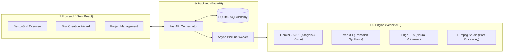
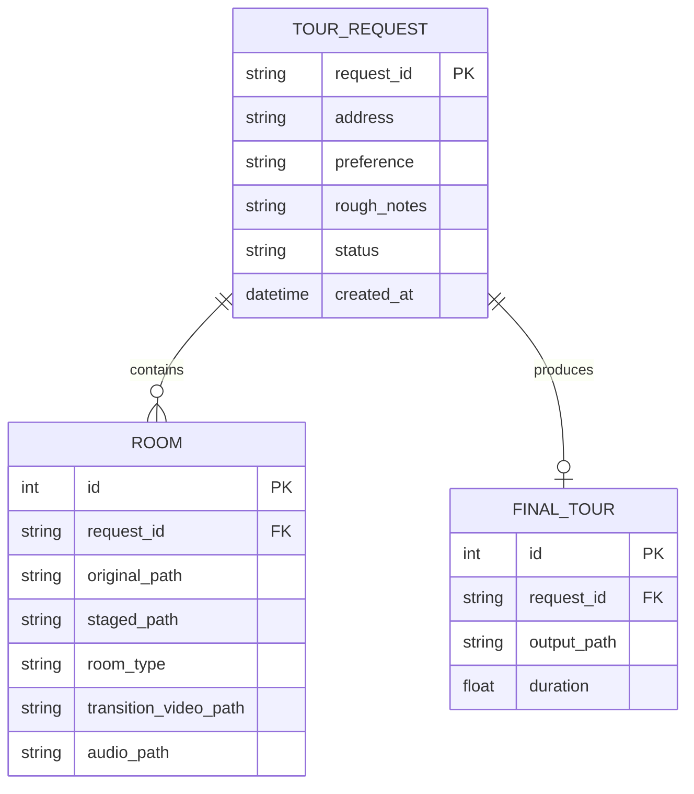
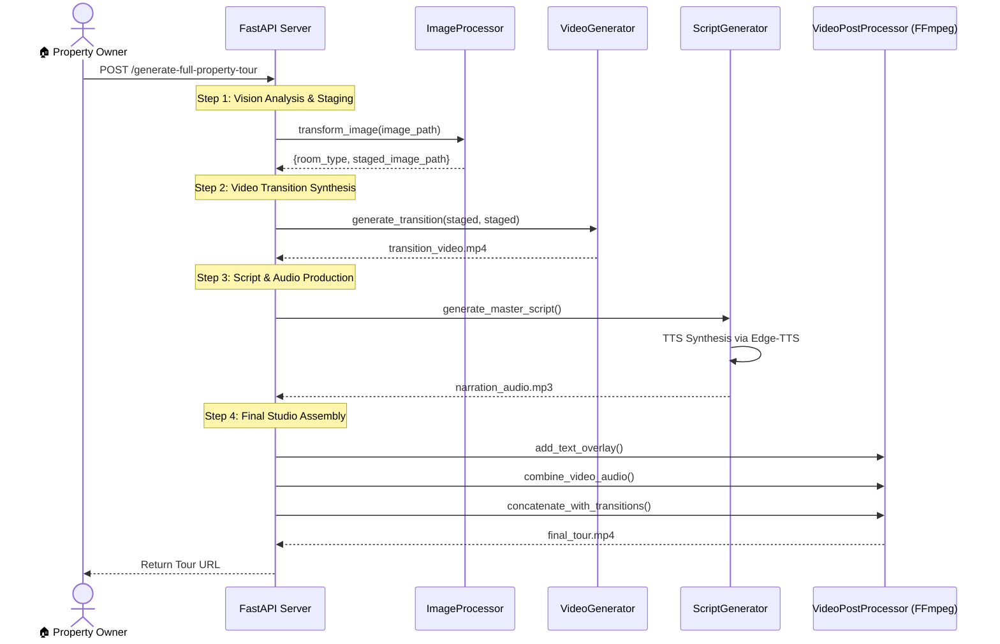
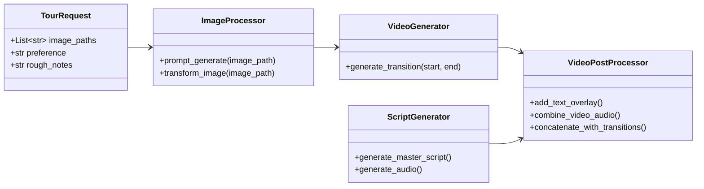
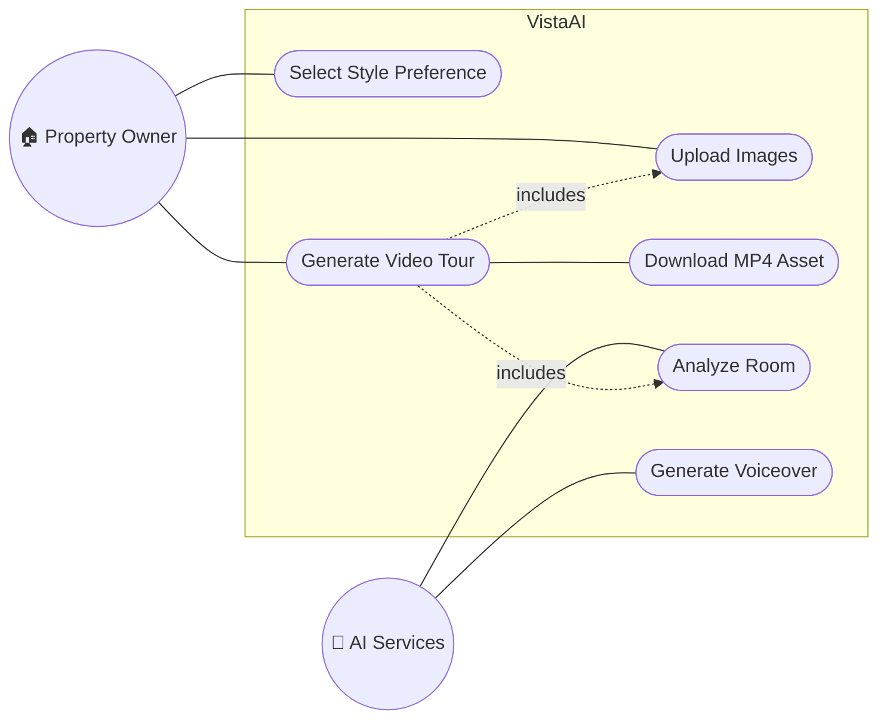

# 🎬 VistaAI: Cinematic Real Estate AI Pipeline


**VistaAI** is an elite, fully-hardenend AI video synthesis platform. It transforms standard architectural photos into high-production-value property tours using ultra-modern Vision and Generative AI.

---

## 💎 The Midnight Aesthetic
VistaAI features a world-class **Midnight Glass & Electric Cyan** UI, engineered with true glassmorphism, glowing volumetric shadows, and fluid micro-animations. It's built for those who value both technical precision and visual excellence.

---

## 🛠️ Technical Evolution (The Hardened Pipeline)

The VistaAI pipeline is a self-healing asynchronous engine designed to handle the complexities of multimodal AI generation.

### 🏛️ System Architecture


---

## 🔄 The Cinematic Pipeline Flow
VistaAI doesn't just "make videos"—it orchestrates a multi-stage creative process.

```mermaid
flowchart TD
    Start(( )) --> Upload([User Submits Images + Preferences])
    Upload --> Analysis([Gemini Vision: Detect Room Type & Vibe])
    Analysis --> Staging([Nano-Banana-Pro: Virtual Interior Design])
    Staging --> Video([Veo 3.1: Synthesis of Cinematic Transitions])
    Video --> Audio([Narration Script & Neural TTS Engine])
    Audio --> Assemble([FFmpeg: Text Overlays + Voice Mix])
    Assemble --> Final([Master Tour Concatenation with Crossfades])
    Final --> End((◉))

    style Start fill:#000,stroke:#000
    style End fill:#000,stroke:#333
    style Analysis fill:#bfdbfe,stroke:#2563eb
    style Staging fill:#bfdbfe,stroke:#2563eb
    style Video fill:#bbf7d0,stroke:#16a34a
    style Audio fill:#fef08a,stroke:#ca8a04
    style Assemble fill:#fbcfe8,stroke:#db2777
    style Final fill:#d9f99d,stroke:#65a30d
```



---

## 🧱 Data Orchestration (ERD)
The persistence layer manages project lifecycles, ensuring a "Single Source of Truth" for every generated property asset.



## 🏗️ System Modeling (UML)

To ensure technical maintainability, VistaAI is documented with full UML specifications.

### 🧵 Sequence Diagram (Orchestration Logic)


### ⚓ Class Diagram (System Hierarchy)


### 👥 Use Case Diagram


---

## 📂 Project Structure

| Module | Responsibility |
|---|---|
| `logics/main.py` | FastAPI entrypoint and Orchestration logic. |
| `logics/image_processing.py` | Vision analysis and Nano Banana Staging (Gemini 3.1). |
| `logics/video_generator.py` | Cinematic video synthesis (Veo 3.1). |
| `logics/script_audio.py` | Script generation and Edge-TTS voice synthesis. |
| `logics/video_utils.py` | FFmpeg assembly, Text Overlays, and Concat Studio. |
| `frontend/src/App.jsx` | Core React Routing and Theme Switching. |
| `frontend/src/index.css` | The "Midnight Glass" Design System tokens. |

---

## ⚡ Quick Start

### 1. Prerequisites
- Python 3.10+
- Node.js 18+
- FFmpeg (Installed on system PATH)

### 2. Environment Setup
Create a `.env` in the root directory:
```bash
GEMINI_API_KEY=your_google_ai_studio_api_key
```

### 3. Backend Deployment
```bash
# Activate your venv
pip install -r requirements.txt
uvicorn logics.main:app --reload
```

### 4. Frontend Deployment
```bash
cd frontend
npm install
npm run dev
```

---

## 🛡️ Reliability Features
- **Self-Healing Fallbacks**: If the cloud API fails, the pipeline automatically switches to local "Fast Styler" mode to ensure tour completion.
- **Infinite Loop Defense**: Explicit temporal capping on all FFmpeg mixes prevents encoder hangs.
- **Async Polling**: The frontend uses reactive status polling to provide real-time updates without page refreshes.

---
> [!NOTE] 
> VistaAI is currently in **Premium MVP v1.0**. All generation credits are managed via the Vertex AI preview program.