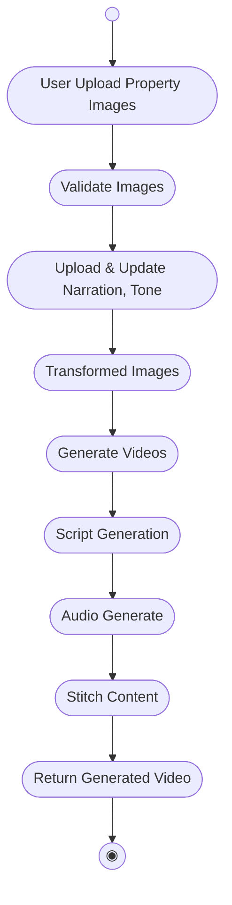
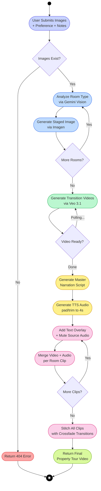
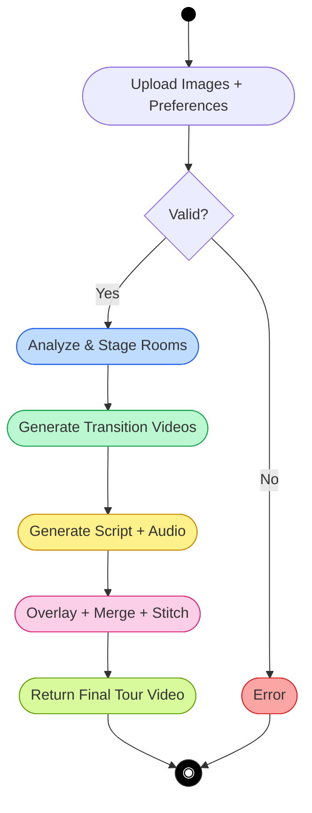

# VistaAI — Activity Diagram

## As-Drawn (from handwritten sketch)

---

## Corrected Version (aligned to actual codebase)

> [!NOTE]
> Corrections:
> - **Narration/Tone is not uploaded separately** — it's part of the initial request as `preference` and `rough_notes`
> - **"Transformed Images"** is an action, not a state — renamed to **"Analyze & Stage Rooms"**
> - Added **decision nodes** — image validation can fail, video generation can fail
> - **Script and Audio are sequential**, not parallel — script must exist before TTS runs
> - **Assembly has 3 sub-steps** — text overlay, audio merge, then xfade stitch (not just "stitch")
> - Added **parallel fork** — Video generation and Script generation can logically run in parallel per room

---

## Compact Version (PPT-Ready)

---

## Corrections Summary

| Handwritten | Corrected | Reason |
|---|---|---|
| "Upload & Update Narration, Tone" as separate step | Merged into initial request | `preference` and `rough_notes` are fields on `TourRequest`, not a separate upload |
| "Transformed Images" (sounds like a state) | **Analyze Room Type** → **Generate Staged Image** (two actions) | `prompt_generate()` and `transform_image()` are two distinct AI calls |
| Purely linear flow | Added **decision nodes** for validation and loops | `os.path.exists()` check + loop over multiple rooms |
| "Stitch Content" (single step) | **3 sub-steps**: overlay → merge audio → xfade stitch | Maps to `add_text_overlay()`, `combine_video_audio()`, `concatenate_with_transitions()` |
| *(missing)* | **Error path** | Pipeline has try/catch returning HTTP 500 |
| *(missing)* | **Color coding** per pipeline phase | Blue=staging, Green=video, Yellow=narration, Pink=assembly |
