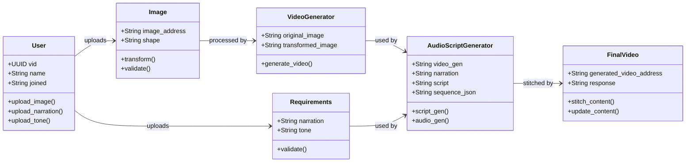
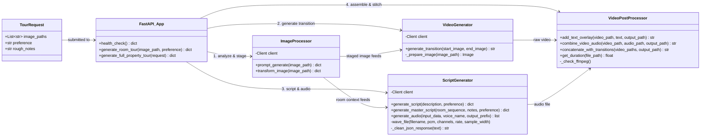

# VistaAI — Class Diagram

## As-Drawn (from handwritten sketch)

---

## Corrected Version (aligned to actual codebase)

> [!NOTE]
> Corrections made:
> - **User** → **TourRequest**: The system uses a `TourRequest` Pydantic model, not a User class
> - **Image** → **ImageProcessor**: Actual class in `image_processing.py` with `prompt_generate()` and `transform_image()`
> - **Requirements** merged into **TourRequest**: preference and rough_notes are fields on the request
> - **VideoGenerator**: Corrected method names to match `generate_transition()`
> - **AudioScriptGenerator** split into **ScriptGenerator**: Separate class in `script_audio.py` handling both script + TTS
> - **FinalVideo** → **VideoPostProcessor**: Actual class in `video_utils.py` with real method names
> - Added **FastAPI App** as the orchestrator connecting everything

