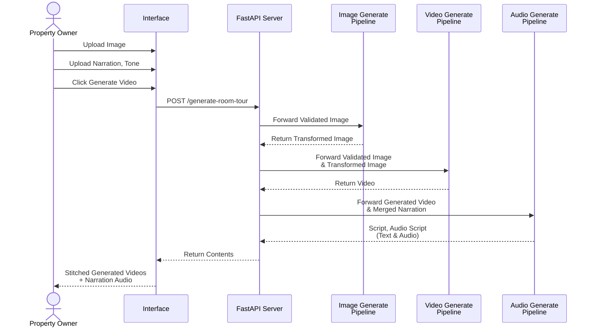
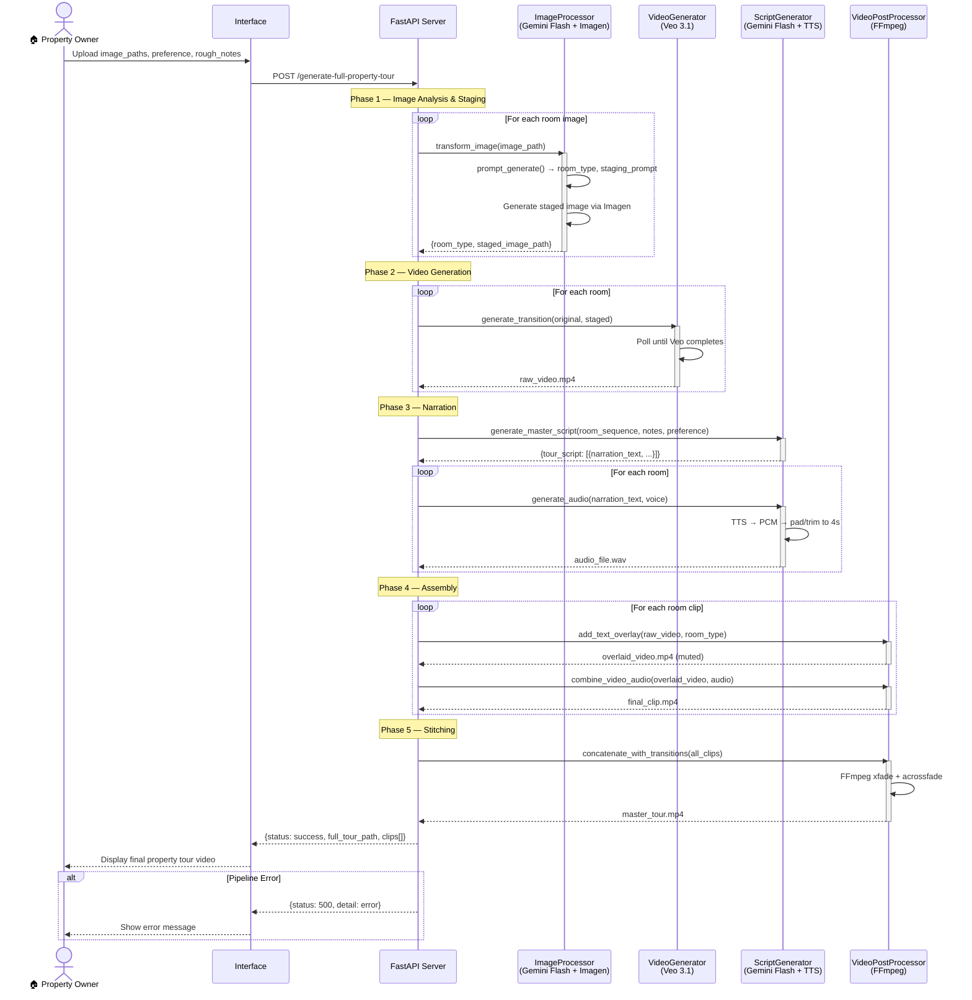
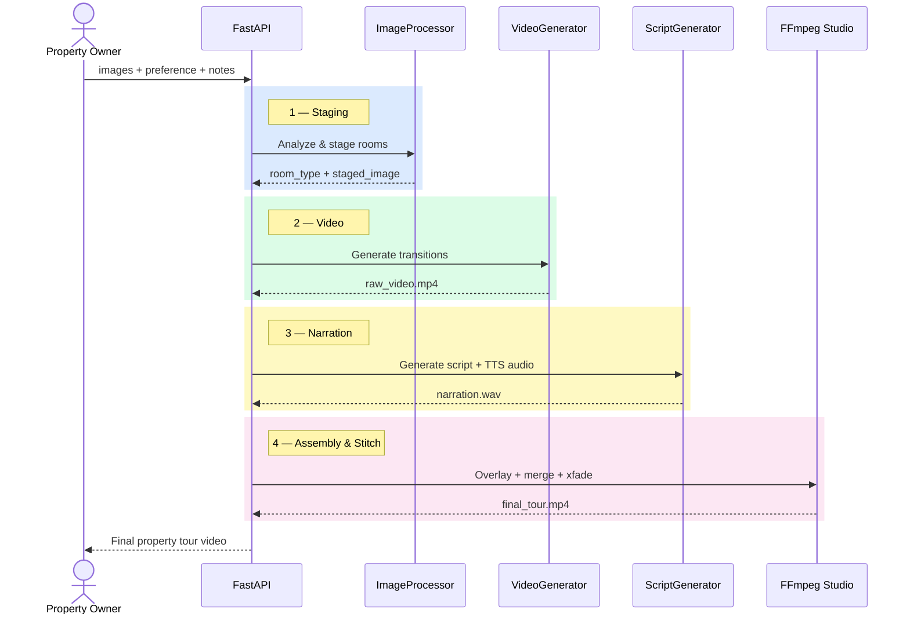

# VistaAI — Sequence Diagram

## As-Drawn (from handwritten sketch)

---

## Corrected Version (aligned to actual codebase)

> [!NOTE]
> Corrections based on actual code flow in `logics/main.py`:
> - **Image Pipeline** doesn't just transform — it first **analyzes** (room type detection) then **stages** (furniture generation). These are two separate AI calls.
> - **Audio Pipeline receives room context**, not "generated video & merged narration". The script is generated from room type + preference, not from the video.
> - **Post-Processing** is a separate step — FFmpeg handles text overlay, audio merge, and cross-fade stitching. This was missing from the original diagram.
> - **Video Pipeline** doesn't interact with Audio. FastAPI orchestrates them independently and merges results via VideoPostProcessor.
> - Added **error handling** alt block since the pipeline has try/catch at every stage.

---

## Corrections Summary

| Handwritten | Corrected | Reason |
|---|---|---|
| "Forward Validated Image" → Image Pipeline | `transform_image()` which internally calls `prompt_generate()` first | Two-step process: analyze room type → then generate staged image |
| Audio receives "Generated Video & Merged Narration" | Script generated from **room_type + preference**, NOT from video | `generate_master_script()` takes room sequence, not video data |
| *(missing)* | **Phase 4: Post-Processing** with FFmpeg | Text overlay (muted) + audio merge is a distinct step via `VideoPostProcessor` |
| *(missing)* | **Phase 5: Stitching** with xfade transitions | `concatenate_with_transitions()` is the final assembly step |
| Single pass flow | **Loop blocks** for multi-room processing | The full tour endpoint processes N rooms sequentially |
| *(missing)* | **Error handling** alt block | Pipeline wraps everything in try/catch, returns 500 on failure |
| 5 participants | **6 participants** — added PostProcessor | FFmpeg post-processing is a separate class (`VideoPostProcessor`) |

---

## Compact Version (PPT-Ready)

