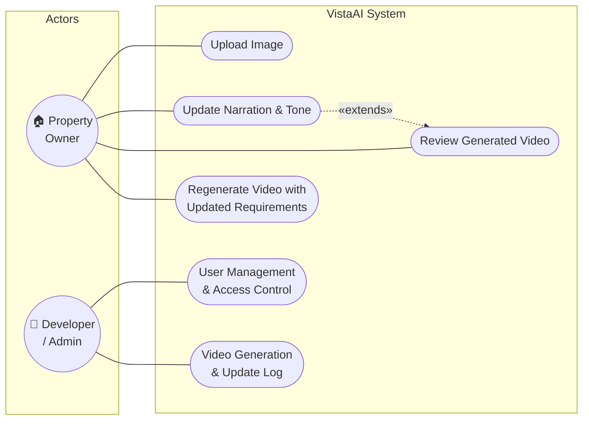
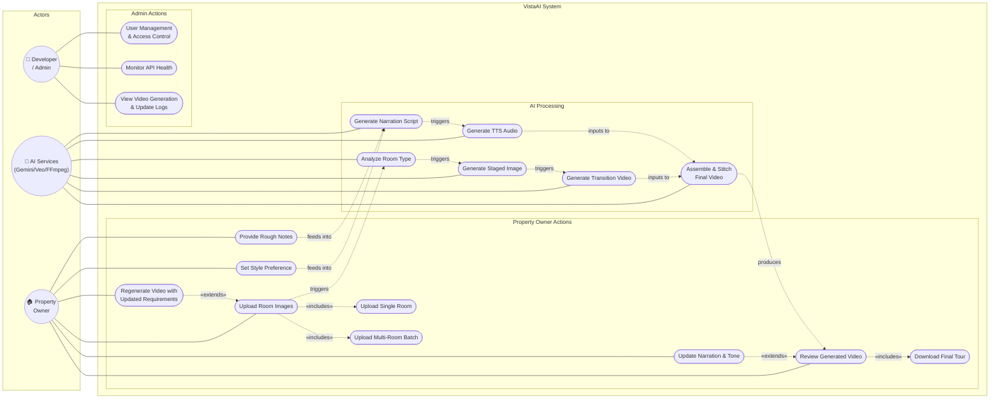

# VistaAI — Use Case Diagram

## As-Drawn (from handwritten sketch)

---

## Corrected Version (aligned to actual codebase)

> [!NOTE]
> Corrections & additions based on the actual VistaAI pipeline:
> - **Upload Image** → split into single room upload and multi-room batch upload (both endpoints exist)
> - **Added "Set Style Preference"** — the `preference` field is a core input in every request
> - **Added "Provide Rough Notes"** — the `rough_notes` field exists for the full tour endpoint
> - **"Review Generated Video"** now `<<includes>>` "Download Final Tour" — reviewing implies accessing the output
> - **"Regenerate Video"** `<<extends>>` the main flow — it's an optional redo with changed params
> - **Added AI System actor** — Gemini/Veo/FFmpeg are external systems the app depends on
> - **Developer** use cases expanded to reflect actual operational needs (API monitoring, FFmpeg health)

---

## Corrections Summary

| Handwritten | Corrected | Reason |
|---|---|---|
| Single "Upload Image" | Split into **Single Room** + **Multi-Room Batch** | Both `/generate-room-tour` and `/generate-full-property-tour` endpoints exist |
| *(missing)* | **Set Style Preference** | `preference` is a key input field on every request |
| *(missing)* | **Provide Rough Notes** | `rough_notes` field exists for full property tours |
| "Update Narration, Tone" extends "Review Video" | **extends** is correct ✅ — updating narration optionally extends reviewing | Kept as-is, this relationship makes sense |
| *(missing)* | **AI Services actor** added | Gemini, Veo, FFmpeg are external systems — standard UML practice |
| *(missing)* | **AI Processing use cases** | Shows what the system does internally (analyze, stage, generate, stitch) |
| "Video Generation & Update Log" | Split into **Monitor API Health** + **View Logs** | More granular admin responsibilities |
